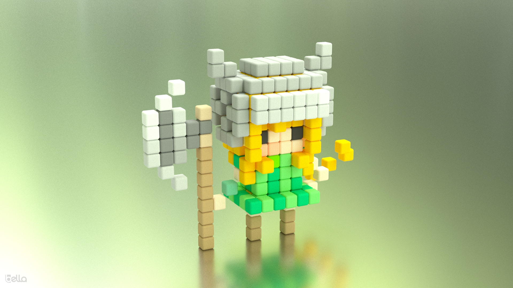

# vox2bella
Prototype learning program. Command line converter from magicaVoxel .vox format to DiffuseLogic's .bsz 

## Usage
```
vox2bella -vi:chr_knight.vox
```


# Build

Download SDK for your OS and drag bella_scene_sdk into your workdir. On Windows rename unzipped folder by removing version ie bella_engine_sdk-24.6.0 -> bella_scene_sdk

```
workdir/
├── bella_scene_sdk/
└── vox2bella/
```

### Linux and Mac
```
cd vox2bella
make
```

### Mac
```
mkdir workdir
cd workdir
curl -LO https://downloads.bellarender.com/bella_engine_sdk-25.3.0-macos.zip
unzip bella_engine_sdk-25.3.0-macos.zip
git clone https://git.indoodle.com/oomer/oom.git
git clone https://github.com/oomer/vox2bella.git
cd vox2bella
make all -j4
```


### Windows
- Install Visual Studio Community 2022
- Add Desktop development with C++ workload
- Launch x64 Native tools Command Prompt for VS2022
```
cd vox2bella
msbuild vox2bella.vcxproj /p:Configuration=release /p:Platform=x64 /p:PlatformToolset=v143
```


